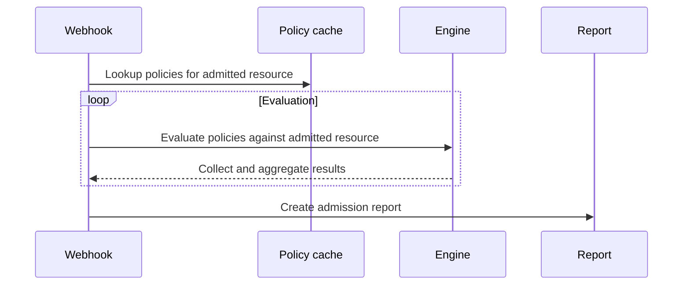
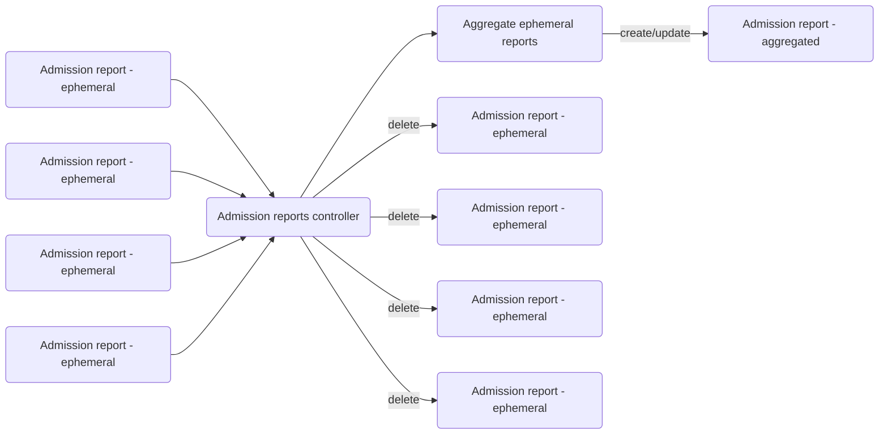
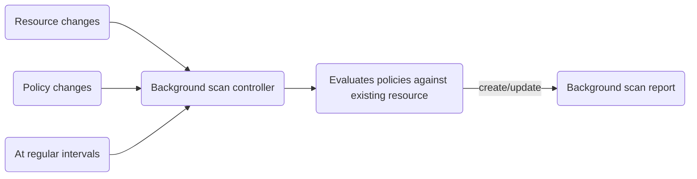
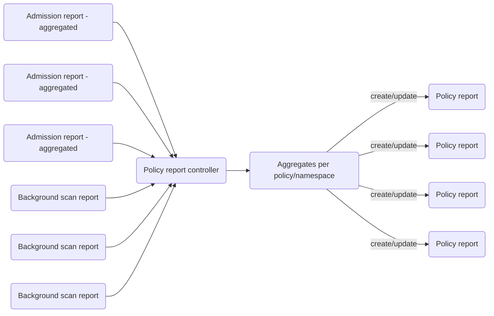
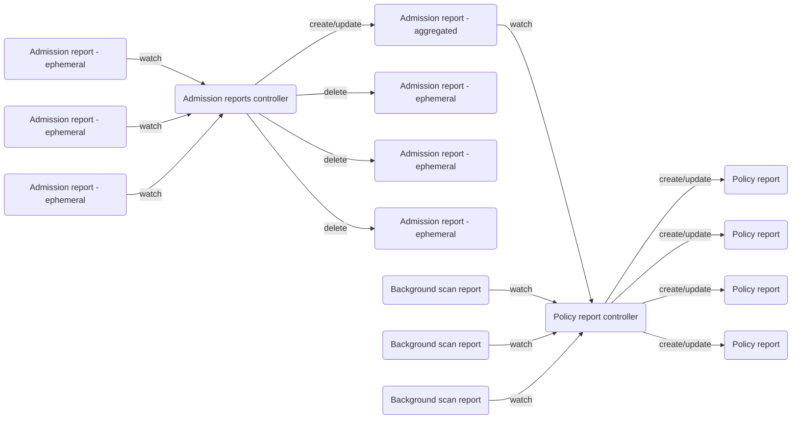

# Reports system design docs

This document summarizes the reports system design.

## Intro

Kyverno generates reports based on policies and matching resources.
Every policy is evaluated against matching resources and the result of the evaluation is recorded in reports.

This happens in two ways:
- at admission time, the policies matching the resource being admitted are evaluated
- in the background, policies are periodically evaluated against matching resources

Admission time reports and background scan reports have a very similar structure but a very different lifecycle.

Reports that are created at admission time and in the background are intermediary reports used internally by Kyverno to produce higher level reports:
- policy reports/cluster policy reports, aggregated per namespace for namespaced resources
- cluster policy reports, aggregated at the cluster level for cluster wide resources

Keep in mind that only validation and image verification rules are recorded in the reports, mutation and generation rules are not.

## Report types

In the following sections we will discuss the different report types, how they are managed and how Kyverno uses them.

### Admission reports

Admission reports are created at resource admission time.
Every time a resource is being admitted, the webhook looks up the policies that need to be evaluated against the resource and a report is created containing the results for this particular admission request.



It's important to note that a resource can be admitted multiple times, CREATE/UPDATE/DELETE, etc... the exact same resource can be admitted multiple times and it's perfectly fine.

One consequence of this is that Kyverno can produce a lot of admission reports for the same resource.

Keeping all those admission reports would be highly inefficient and they would accumulate in the cluster as new admission reports come in.
To prevent admission reports from piling up in the cluster, Kyverno continuously aggregates admission reports into a single one per underlying resource.



With that in mind, it's important to note that most admission reports should be short lived and exist only until they have been aggregated.
Aggregated admission reports can be identified by the `audit.kyverno.io/report.aggregate` label.

Only the aggregated report is expected to be long lived and eventually share the same lifecycle as the underlying resource.
To aggregate reports together, Kyverno groups results per policy/rule and keeps the most recent one.

### Background scan reports

Background scan reports are produced in the background at regular intervals or when something changes in the policy or the resource.
There is always a one-to-one relationship between a resource and a background scan report.

Kyverno updates the same background scan report over and over when policies are evaluated against a resource in the background scan process.



### Policy reports

Policy reports (and cluster policy reports) are the result of aggregating admission reports and background scan reports per policy, at the namespace level (for namespaced resources) and at the cluster level (for cluster wide resources).

Please note that only aggregated admission reports are considered, it would not make sense to consider short lived admission reports here.

To reduce the computation power needed, especially when resources change frequently, we introduce a queue and a delay (`30s`):
- Watch when an admission report and/or background scan report is CREATED, UPDATED or DELETED
- Put the namespace of the report in the queue (`""` if the report is clustered) with a delay of `30s`
- The queue guarantees that only a single worker will process an item at the same time
- When the worker gets the namespace from the queue it lists all admission reports and background scan reports for that particular namespace, aggregates them together and reconciles the existing policy reports

This process can have a significant impact on the number of API calls and the memory footprint, especially when we have large reports.
To mitigate this we use LIST api calls with pagination and reports are aggregated before loading the next page.




### Conclusion

The entire flow looks like this:



Not shown in this diagram:
- background scan controller watches resources/policies and maintains an up to date background scan report

## Storage considerations

The system stores everything in etcd, admission reports (aggregated and short lived ones), background scan reports, and policy reports/cluster policy reports.

### Admission reports and background scan reports

If we omit the short lived admission reports, this usually means 2 additional resources per managed resource:
- one aggregated admission report
- one background scan report

Short lived admission reports are ephemeral in nature, as long as they cleaned up correctly they shouldn't impact storage too much.
If for some reason Kyverno fails to cleanup those reports fast enough it can become a severe issue though.

Of course not all resources will have background scan reports, some policies can have `background` disabled but you get the picture.
One thing to note here is that it doesn't vary with the number of policies in the cluster. The number of policies will have an impact on the report size though, but not on the number of reports.

Still, admission and background scan reports are usually small sized because they are for a single resource.

### Policy reports and cluster policy reports

For policy reports it's different, the number of policy reports will depend on the number of policies and the number of namespaces:
- one report per policy and per namespace for namespaced resources (10 policies and 20 namespaces -> 200 reports)
- one report per policy for clustered resources (10 policies -> 10 reports)

Policy reports and cluster policy reports are usually much larger, depending on the number of resources in the cluster/namespace.
Sometimes they are too big to be stored in etcd and we split them into multiple reports containing a configurable number entries (`1000` by default).

### Reports deletion

Quick note about reports deletion, we use the builtin Kubernetes garbage collection mechanism for that. Reports are owned by the resource they apply to and when the resource goes away, reports are garbage collected and deleted automatically.

### Conclusion

Sizing is not an easy task and will depend on the number of policy/rules and resources in a cluster.
The size of individual reports will also vary depending on the rule message, the longer the message, the more disk space will be consumed.

The best approach is to measure the average size of an individual report and multiply this size by three times the number of resources for a given type.

```
If a report for a Pod is 1KB and there's 100 pods.

Disk budget = 100 * 1KB * 3
```

See below for an example based on PSS policies.

## PSS policies example

When deploying PSS policies (with `restricted` profile), it creates:
- 17 policies
- all together, it's 19 rules in total

For every `Pod` in the cluster it will create a background scan report like this and a similar admission report (aggregated):

```yaml
apiVersion: kyverno.io/v1alpha2
kind: BackgroundScanReport
metadata:
  annotations:
    audit.kyverno.io/last-scan-time: "2023-04-16T15:37:53Z"
  creationTimestamp: "2023-04-16T15:37:53Z"
  generation: 2
  labels:
    app.kubernetes.io/managed-by: kyverno
    audit.kyverno.io/resource.hash: dae620c229e01ae80bf829cfd8325920
    audit.kyverno.io/resource.uid: bb228314-0e3e-42c2-b945-63efe9279ad4
    cpol.kyverno.io/disallow-capabilities: "226174"
    cpol.kyverno.io/disallow-capabilities-strict: "226697"
    cpol.kyverno.io/disallow-host-namespaces: "226184"
    cpol.kyverno.io/disallow-host-path: "226191"
    cpol.kyverno.io/disallow-host-ports: "226145"
    cpol.kyverno.io/disallow-host-process: "226185"
    cpol.kyverno.io/disallow-privilege-escalation: "226708"
    cpol.kyverno.io/disallow-privileged-containers: "226180"
    cpol.kyverno.io/disallow-proc-mount: "226172"
    cpol.kyverno.io/disallow-selinux: "226187"
    cpol.kyverno.io/require-run-as-non-root-user: "226717"
    cpol.kyverno.io/require-run-as-nonroot: "226729"
    cpol.kyverno.io/restrict-apparmor-profiles: "226181"
    cpol.kyverno.io/restrict-seccomp: "226167"
    cpol.kyverno.io/restrict-seccomp-strict: "226746"
    cpol.kyverno.io/restrict-sysctls: "226169"
    cpol.kyverno.io/restrict-volume-types: "226761"
  name: bb228314-0e3e-42c2-b945-63efe9279ad4
  namespace: kyverno
  ownerReferences:
  - apiVersion: v1
    kind: Pod
    name: kyverno-admission-controller-7d998c79c4-rj7th
    uid: bb228314-0e3e-42c2-b945-63efe9279ad4
  resourceVersion: "226964"
  uid: d4721704-e188-4dcd-ad39-be7e8cc92707
spec:
  results:
  - category: Pod Security Standards (Baseline)
    message: validation rule 'adding-capabilities' passed.
    policy: disallow-capabilities
    result: pass
    rule: adding-capabilities
    scored: true
    severity: medium
    source: kyverno
    timestamp:
      nanos: 0
      seconds: 1681659473
  - category: Pod Security Standards (Restricted)
    message: rule passed
    policy: disallow-capabilities-strict
    result: pass
    rule: adding-capabilities-strict
    scored: true
    severity: medium
    source: kyverno
    timestamp:
      nanos: 0
      seconds: 1681659534
  - category: Pod Security Standards (Restricted)
    message: rule passed
    policy: disallow-capabilities-strict
    result: pass
    rule: require-drop-all
    scored: true
    severity: medium
    source: kyverno
    timestamp:
      nanos: 0
      seconds: 1681659534
  - category: Pod Security Standards (Baseline)
    message: validation rule 'host-namespaces' passed.
    policy: disallow-host-namespaces
    result: pass
    rule: host-namespaces
    scored: true
    severity: medium
    source: kyverno
    timestamp:
      nanos: 0
      seconds: 1681659473
  - category: Pod Security Standards (Baseline)
    message: validation rule 'host-path' passed.
    policy: disallow-host-path
    result: pass
    rule: host-path
    scored: true
    severity: medium
    source: kyverno
    timestamp:
      nanos: 0
      seconds: 1681659473
  - category: Pod Security Standards (Baseline)
    message: validation rule 'host-ports-none' passed.
    policy: disallow-host-ports
    result: pass
    rule: host-ports-none
    scored: true
    severity: medium
    source: kyverno
    timestamp:
      nanos: 0
      seconds: 1681659473
  - category: Pod Security Standards (Baseline)
    message: validation rule 'host-process-containers' passed.
    policy: disallow-host-process
    result: pass
    rule: host-process-containers
    scored: true
    severity: medium
    source: kyverno
    timestamp:
      nanos: 0
      seconds: 1681659473
  - category: Pod Security Standards (Restricted)
    message: validation rule 'privilege-escalation' passed.
    policy: disallow-privilege-escalation
    result: pass
    rule: privilege-escalation
    scored: true
    severity: medium
    source: kyverno
    timestamp:
      nanos: 0
      seconds: 1681659534
  - category: Pod Security Standards (Baseline)
    message: validation rule 'privileged-containers' passed.
    policy: disallow-privileged-containers
    result: pass
    rule: privileged-containers
    scored: true
    severity: medium
    source: kyverno
    timestamp:
      nanos: 0
      seconds: 1681659473
  - category: Pod Security Standards (Baseline)
    message: validation rule 'check-proc-mount' passed.
    policy: disallow-proc-mount
    result: pass
    rule: check-proc-mount
    scored: true
    severity: medium
    source: kyverno
    timestamp:
      nanos: 0
      seconds: 1681659473
  - category: Pod Security Standards (Baseline)
    message: validation rule 'selinux-type' passed.
    policy: disallow-selinux
    result: pass
    rule: selinux-type
    scored: true
    severity: medium
    source: kyverno
    timestamp:
      nanos: 0
      seconds: 1681659473
  - category: Pod Security Standards (Baseline)
    message: validation rule 'selinux-user-role' passed.
    policy: disallow-selinux
    result: pass
    rule: selinux-user-role
    scored: true
    severity: medium
    source: kyverno
    timestamp:
      nanos: 0
      seconds: 1681659473
  - category: Pod Security Standards (Restricted)
    message: validation rule 'run-as-non-root-user' passed.
    policy: require-run-as-non-root-user
    result: pass
    rule: run-as-non-root-user
    scored: true
    severity: medium
    source: kyverno
    timestamp:
      nanos: 0
      seconds: 1681659534
  - category: Pod Security Standards (Restricted)
    message: validation rule 'run-as-non-root' anyPattern[1] passed.
    policy: require-run-as-nonroot
    result: pass
    rule: run-as-non-root
    scored: true
    severity: medium
    source: kyverno
    timestamp:
      nanos: 0
      seconds: 1681659534
  - category: Pod Security Standards (Baseline)
    message: validation rule 'app-armor' passed.
    policy: restrict-apparmor-profiles
    result: pass
    rule: app-armor
    scored: true
    severity: medium
    source: kyverno
    timestamp:
      nanos: 0
      seconds: 1681659473
  - category: Pod Security Standards (Baseline)
    message: validation rule 'check-seccomp' passed.
    policy: restrict-seccomp
    result: pass
    rule: check-seccomp
    scored: true
    severity: medium
    source: kyverno
    timestamp:
      nanos: 0
      seconds: 1681659473
  - category: Pod Security Standards (Restricted)
    message: validation rule 'check-seccomp-strict' anyPattern[1] passed.
    policy: restrict-seccomp-strict
    result: pass
    rule: check-seccomp-strict
    scored: true
    severity: medium
    source: kyverno
    timestamp:
      nanos: 0
      seconds: 1681659534
  - category: Pod Security Standards (Baseline)
    message: validation rule 'check-sysctls' passed.
    policy: restrict-sysctls
    result: pass
    rule: check-sysctls
    scored: true
    severity: medium
    source: kyverno
    timestamp:
      nanos: 0
      seconds: 1681659473
  - category: Pod Security Standards (Restricted)
    message: validation rule 'restricted-volumes' passed.
    policy: restrict-volume-types
    result: pass
    rule: restricted-volumes
    scored: true
    severity: medium
    source: kyverno
    timestamp:
      nanos: 0
      seconds: 1681659534
  summary:
    error: 0
    fail: 0
    pass: 19
    skip: 0
    warn: 0
```

That's 6.28KB of json data per report.
If you have 1000 pods in a cluster, it gives:
- 1000 admission reports (aggregated) - 6.28KB * 1000 ~ 6.28 MB
- 1000 background scan reports - 6.28KB * 1000 ~ 6.28 MB

With autogen you have to account for `Deployment`, `StatefulSet`, `Job`, `CronJob`, `ReplicaSet` too (reports for them will be approximately the same size).

And of course ephemeral admission reports consume space too, even if they should be cleaned up quickly.

Finally you need to take policy reports into account too.
Basically they should consume approximately the same disk space as background scan reports (approximately because if some policies don't run in the background, results will come from aggregated admission reports).

The number of policy reports is usually inferior to the number of other reports but they are bigger in size.

In the end, to use PSS policies (with `restricted` profile) on a 1000 pods cluster, you should budget around 25MB of etcd storage, spread across ~2000 reports.

In comparison, an average `Pod` is around 5KB (at least for a pod with a single container). The storage for 1000 pods is around 5MB. We can see that reports has a significant storage impact. Fortunately ETCD stores data on disk and associated cost should be negligible.