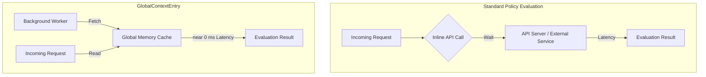

# GlobalContextEntry

By centralizing and pre-fetching heavy datasets, multiple policies can evaluate
incoming mutation, validation, or generation requests instantly by adding a
`context` entry using `globalReference`. The cached data is then accessible
via the variable name assigned in that context entry (e.g., `cached_configmaps`).

> **HA Note:** In high-availability deployments, each Kyverno replica maintains
> its own independent in-memory cache. Admission requests may be served by
> different replicas whose cache freshness can differ slightly between refresh
> cycles. This is expected behavior — design your policies to tolerate this
> per-replica eventual consistency.

---

## Prerequisites

Before configuring a `GlobalContextEntry`, ensure the following:

- **Kyverno >= 1.12.0** is installed in your cluster (`GlobalContextEntry`
  was introduced in this release). Verify your version with:
  ```bash
    kubectl get pod -n kyverno -l app=kyverno -o jsonpath='{.items[0].spec.containers[0].image}'
  ```

- **kubectl** access with sufficient permissions to create cluster-scoped resources.
- **Kyverno ServiceAccount RBAC:** For `kubernetesResource` mode, the Kyverno
  ServiceAccount must have `get`, `list`, and `watch` permissions on the target
  resource. This is especially important for custom resources (CRs).

> **API Version Note:** `GlobalContextEntry` uses `apiVersion: kyverno.io/v2`
> while `ClusterPolicy` and `Policy` resources use `apiVersion: kyverno.io/v1`.
> This is expected — they are separate resource kinds with independent API
> version tracks. To confirm the served API versions on your cluster, run:
> ```bash
> kubectl api-resources | grep kyverno
> ```


### Granting RBAC Permissions for Custom Resources (CRs)
If you are caching a **custom resource (CR)** served by a CRD — for example,
a resource from a custom API group — append a rule to Kyverno's existing
ClusterRole using a JSON patch:

```bash
kubectl patch clusterrole kyverno:admission-controller --type=json --patch '[{"op":"add","path":"/rules/-","value":{"apiGroups":["your.crd.group"],"resources":["yourresources"],"verbs":["get","list","watch"]}}]'
```

> **Note:** Replace `your.crd.group` and `yourresources` with your actual
> CRD API group and resource name (lowercased, pluralized). This appends
> to the existing rules without overwriting them. Standard resources like
> `configmaps` and `secrets` already have permissions by default — no
> patch needed.

---


## Concept & Architecture: The "Why"



Kyverno operates natively as a Kubernetes Admission Controller webhook. When a resource lifecycle event occurs (e.g., `kubectl apply`), Kyverno intercepts the request and must determine whether to allow or deny it with minimal latency.

### The Problem: Reactive Inline Lookup Bottlenecks
Traditionally, when a policy requires data outside the immediate admission review payload—such as comparing an incoming image tag against an allowed private enterprise registry list stored in a cluster `ConfigMap`—it relies on an inline `apiCall` context variable.

Under high cluster density, if a continuous integration or continuous deployment (CI/CD) engine (e.g., Argo CD or Flux) executes a massive batch deployment of 200 microservices simultaneously:
* Kyverno is forced to instantiate **200 separate, concurrent network calls** to the Kubernetes API server or target external webhooks to retrieve identical tracking data.
* This scenario creates severe internal network latency spikes, induces heavy connection-throttling at the API server layer, and heavily balloons cluster CPU utilization, occasionally prompting admission timeouts.

### The Solution: Global Memory Caching
`GlobalContextEntry` decouples the policy execution pathway from external network dependencies entirely.

Instead of executing real-time fetches during admission evaluation, Kyverno delegates resource
tracking to an asynchronous background worker loop:
1. **Background Collection:** Kyverno queries the designated cluster resource or external target once, building a localized memory structure.
2. **Deterministic Refreshing:** For `apiCall` mode, Kyverno polls the target at user-configured `refreshInterval` intervals. For `kubernetesResource` mode, Kyverno uses Kubernetes watch/informer mechanisms to automatically track resource changes without polling.
3. **Instant Lookup Execution:** When the same batch of 200 microservices triggers policy evaluations, Kyverno serves the evaluation data directly out of local RAM cache. Network overhead drops to near 0 ms, ensuring horizontal stability at massive organizational scales.

---

## Getting Started

The fastest way to use `GlobalContextEntry` is a two-step process: define a cache entry, then reference it in a policy.

### Step 1: Create a GlobalContextEntry

```yaml
apiVersion: kyverno.io/v2
kind: GlobalContextEntry
metadata:
  name: my-first-cache
spec:
  kubernetesResource:
    group: ""
    version: v1
    resource: configmaps
    namespace: default
```

### Step 2: Reference it in a Policy

```yaml
context:
  - name: cached_configmaps
    globalReference:
      name: my-first-cache
      jmesPath: "[].metadata.name"
```

`{{ cached_configmaps }}` is now available inside your policy rules with zero inline API call overhead. See [Configuration Modes](#configuration-modes) for the full schema reference.

---

## Configuration Modes

A `GlobalContextEntry` must set exactly one of the following mutually exclusive
source fields:

* `kubernetesResource`: Monitors and maps native objects living within the cluster.
* `apiCall`: Polls external endpoints or performs structured internal HTTP interactions.

Optionally, either mode can also include a `projections` block to pre-filter
the cached data using JMESPath before policies consume it.

### 1. Kubernetes Resource Caching

Use this mode to capture internal topology data, structural metadata, or shared configuration boundaries (e.g., `ConfigMaps`, `Namespaces`, or custom resource configurations).

| Schema Field | Value Data Type | Required | Engine Validation Constraints |
| :--- | :--- | :--- | :--- |
| `group` | string | Conditional | The Kubernetes API group (e.g., `apps`). Required for non-core resources. Use an empty string `""` only for core API resources with `version: v1`. |
| `version` | string | **Yes** | The explicit API version state (e.g., `v1`, `v1beta1`). |
| `resource` | string | **Yes** | **Must be lowercased and pluralized** (e.g., use `configmaps` or `secrets`, not `ConfigMap`). |
| `namespace` | string | No | The target namespace boundaries. If omitted, Kyverno tracks across **all namespaces** globally. |

> **Important:** Ensure the Kyverno ServiceAccount has the necessary RBAC
> permissions (`get`, `list`, `watch`) for the resources you are caching,
> especially when tracking custom resources (CRs).

#### Syntax Example: Local ConfigMap Tracking
```yaml
apiVersion: kyverno.io/v2
kind: GlobalContextEntry
metadata:
  name: configmap-cache
spec:
  kubernetesResource:
    group: ""
    version: v1
    resource: configmaps
    namespace: default
```
### 2. External API Caching

Use this mode to extract and synchronize authorization lists, identity definitions, or operational constraints managed outside the local Kubernetes ecosystem.

| Schema Field | Default Value | Engine Validation Constraints |
| :--- | :--- | :--- |
| `urlPath` | — | Path for querying the **local Kubernetes API server**. Mutually exclusive with `service.url`. |
| `service.url` | — | Full URL for **external endpoints**. Mutually exclusive with `urlPath`. |
| `refreshInterval` | `10m` | Background polling cadence. Accepts duration strings (e.g., `30s`, `5m`, `2h`). Must be > `0s`. |
| `retryLimit` | `3` | Max retry attempts before the sync loop errors. Minimum value is `1`. |
| `method` | `GET` | HTTP method. **Must be explicitly set to `POST`** if a `data` payload array is provided. |

> **Method Enforcement:** If your `apiCall` profile passes a custom request payload under the `data` array parameter, the underlying HTTP schema engine enforces that the `method` parameter **must be explicitly configured as POST**.

#### Syntax Example: External Metadata Ingestion

```yaml
apiVersion: kyverno.io/v2
kind: GlobalContextEntry
metadata:
  name: corporate-teams-cache
spec:
  apiCall:
    service:
      url: "https://api.internal.corporate/v1/teams"
    refreshInterval: 5m
    retryLimit: 5
```
## Data Projections (JMESPath Slicing)

Caching large-scale external API payloads or extensive multi-namespace collections inside memory can stress system overhead. Kyverno supports `projections` using **JMESPath** so policies can work with a narrower, more focused view of that cached data.

> **Note on API Sources:**
> - Use `urlPath` when querying the **local Kubernetes API server** (e.g., fetching internal cluster resources).
> - Use `service.url` when targeting **external endpoints** (e.g., external inventory or security services).

> These two fields are **mutually exclusive** — only one may be defined per `apiCall` entry.

 Projections act as a high-performance filtering layer, transforming raw complex structures into exact key-value primitives or explicit string arrays for policy consumption. This helps simplify policy evaluation and reduce the amount of data rules need to traverse, but it does not necessarily remove the underlying cached payload.

Projections work with both `urlPath` (Kubernetes API server) and `service.url`
(external endpoints). Here are both forms:

**For Kubernetes API server responses** — use `urlPath`:

```yaml
apiVersion: kyverno.io/v2
kind: GlobalContextEntry
metadata:
  name: my-k8s-cached-data
spec:
  apiCall:
    urlPath: "/api/v1/namespaces/default/configmaps"
  projections:
    - name: config-names
      jmesPath: "items[].metadata.name"
```

**For external endpoint responses** — use `service.url`:

```yaml
apiVersion: kyverno.io/v2
kind: GlobalContextEntry
metadata:
  name: my-external-cached-data
spec:
  apiCall:
    service:
      url: "https://api.internal.corporate/v1/teams"
    refreshInterval: 5m
  projections:
    - name: team-ids
      jmesPath: "teams[].id"
```

> `urlPath` and `service.url` are **mutually exclusive** — only one may be
> defined per `apiCall` entry. Use `urlPath` for in-cluster Kubernetes API
> resources and `service.url` for all external HTTP endpoints.


### Referencing Cached Data in a Policy

Reference a `GlobalContextEntry` in your policy context using `globalReference`.
Use the `jmesPath` field to filter the cached payload at reference time:

```yaml
context:
  - name: cached_configmaps
    globalReference:
      name: shared-config-cache        # GlobalContextEntry name
      jmesPath: "[].metadata.name"     # filter applied at reference time
```

> **JMESPath shape reminder:**
> - `kubernetesResource` mode → use `[].metadata.name`
> - `apiCall.urlPath` mode → use `items[].metadata.name`

If you defined `projections` in your `GlobalContextEntry` spec, the projection
name can be used directly as the `jmesPath` value:

```yaml
context:
  - name: myData
    globalReference:
      name: my-k8s-cached-data
      jmesPath: "config-names"   # matches projections[].name in the spec
```


## Eventual Consistency & Operational Notes

**Eventual Consistency:** Caches are updated asynchronously. Policy evaluations may briefly use slightly stale data between refresh cycles. Design your policy logic to tolerate this window, particularly for rapidly changing resources.

**Production Security — External API Calls:**
- Store credentials in Kubernetes `Secrets`, never hardcoded in the resource spec.
- Ensure all external endpoints are protected with valid TLS certificates.

**Inline `apiCall` vs. `GlobalContextEntry` — When to Use Which:**

| Feature | Inline `apiCall` | `GlobalContextEntry` |
| :--- | :--- | :--- |
| **Performance** | High overhead (one call per request) | High performance (served from RAM cache) |
| **Use Case** | Real-time, volatile data | Static or slowly changing data |
| **Scalability** | Can overwhelm API servers under load | Significantly reduces API server load |
| **Data Freshness** | Always current | Eventually consistent |

### Behavior on Cache Failure

If a `GlobalContextEntry` fails to sync (e.g., external endpoint is unreachable
and `retryLimit` is exhausted):

- The cache retains its **last known good state** until a successful refresh occurs.
- If no data has ever been cached (e.g., on first startup), policies referencing
  that entry will receive an **empty result**, which may cause unexpected denials
  depending on your rule logic.
- Monitor `status.conditions` on the resource and set up alerts on Kyverno
  controller logs for `globalcontext` errors in production clusters.

## Practical Use Cases & Blueprints

### 1. Referencing Shared ConfigMap Data Across Multiple Policies

This scenario caches cluster-wide configuration mappings centrally so multiple running rules can cross-reference them without individual cluster query costs.

#### Step 1: Define the Cache entry

```yaml
apiVersion: kyverno.io/v2
kind: GlobalContextEntry
metadata:
  name: shared-config-cache
spec:
  kubernetesResource:
    group: ""
    version: v1
    resource: configmaps
    namespace: default
```
> **JMESPath Structure Note:** The shape of cached data differs by mode:
>
> - **`kubernetesResource` mode** returns a raw array. Use `[].metadata.name`
> - **`apiCall.urlPath` mode** returns a Kubernetes API envelope with `items[]`. Use `items[].metadata.name`
>
> Using the wrong shape silently returns an empty result. Check your cached
> payload first with `kubectl get globalcontextentries <name> -o yaml`.

#### Step 2: Bind a Policy to the Entry

```yaml
apiVersion: kyverno.io/v1 # ClusterPolicy stays on v1 — this is correct
kind: ClusterPolicy
metadata:
  name: require-configmap-via-gctx
spec:
  validationFailureAction: Enforce
  background: false
  rules:
  - name: configmap-must-exist
    match:
      any:
      - resources:
          kinds:
          - Deployment
    context:
      - name: cached_configmaps
        globalReference:
          name: shared-config-cache
          jmesPath: "[].metadata.name"
    validate:
      message: "Deployment initialization rejected. Required 'app-config' asset missing from GlobalContext cache."
      deny:
        conditions:
          any:
          - key: "app-config"
            operator: AnyNotIn
            value: "{{ cached_configmaps }}"
```
### 2. Caching Approved Container Registries (External API)

This implementation ensures cluster deployments pull strictly from vetted, enterprise-controlled image domains stored on an external inventory catalog manager.

#### Step 1: Define the Cache entry

```yaml
apiVersion: kyverno.io/v2
kind: GlobalContextEntry
metadata:
  name: approved-registries-cache
spec:
  apiCall:
    service:
      url: "https://api.corporate.internal/v1/registries"
    refreshInterval: 30m
    retryLimit: 3
```
#### Step 2: Bind a Policy to the Entry

Assuming the API returns: `{"allowed": ["internal-registry.io", "gcr.io/vetted-project"]}`

```yaml
apiVersion: kyverno.io/v1
kind: ClusterPolicy
metadata:
  name: restrict-registries-global
spec:
  validationFailureAction: Enforce
  background: false
  rules:
  - name: check-image-registry
    match:
      any:
      - resources:
          kinds:
          - Pod
    context:
      - name: allowed_registries
        globalReference:
          name: approved-registries-cache
          jmesPath: "allowed"
    validate:
      message: "The container image registry is not approved by enterprise security policy."
      foreach:
      - list: "request.object.spec.containers"
        deny:
          conditions:
            any:
            - key: "{{ split(element.image, '/')[0] }}"
              operator: AnyNotIn
              value: "{{ allowed_registries }}"
```
> **How the registry is extracted:** `split(element.image, '/')[0]` splits the
> full image string (e.g., `internal-registry.io/myapp:v1`) on `/` and takes
> the first segment as the registry hostname. This avoids nested template
> expressions which Kyverno cannot evaluate inside a `foreach` loop.
>
> Ensure your `allowed_registries` list contains registry hostnames only
> (e.g., `"internal-registry.io"`, `"gcr.io"`), not full image paths.

### 3. Caching RBAC or Organizational Metadata

Useful for performance-heavy validation structures, like tracking dynamic team metadata roles across specific namespace boundaries.

#### Step 1: Define the Cache entry

```yaml
apiVersion: kyverno.io/v2
kind: GlobalContextEntry
metadata:
  name: rbac-team-cache
spec:
  kubernetesResource:
    group: "rbac.authorization.k8s.io"
    version: v1
    resource: clusterrolebindings
```
#### Step 2: Bind a Policy to the Entry

```yaml
apiVersion: kyverno.io/v1
kind: ClusterPolicy
metadata:
  name: validate-team-namespace-access
spec:
  validationFailureAction: Enforce
  background: false
  rules:
  - name: restrict-namespace-creation
    match:
      any:
      - resources:
          kinds:
          - Namespace
    context:
      - name: cluster_bindings
        globalReference:
          name: rbac-team-cache
          jmesPath: "[].subjects[?kind=='User'].name"
    validate:
      message: "User initiating namespace creation is not registered in cluster role metadata."
      deny:
        conditions:
          any:
          - key: "{{ request.userInfo.username }}"
            operator: AnyNotIn
            value: "{{ cluster_bindings }}"
```

## Verification

> **Note:** `gctxentry` is the registered short name for `globalcontextentries`.
> Both forms work — use whichever you prefer.
```bash
# Linux/macOS
kubectl api-resources | grep kyverno

# Windows
kubectl api-resources | findstr kyverno
```

Use the following steps to confirm your `GlobalContextEntry` is actively syncing
and your policies can consume its data correctly.

### 1. Check Resource Status & Conditions

```bash
kubectl get globalcontextentries <entry-name> -o yaml
```

Look for the `status` block in the output. A healthy entry looks like this:

```yaml
status:
  conditions:
    - type: Ready
      status: "True"
      reason: Synced
      message: "GlobalContextEntry synced successfully"
  lastRefreshTime: "YYYY-MM-DDThh:mm:ssZ"  # e.g. "2024-01-15T10:30:00Z"
```

Key fields to inspect:

| Field | What to Check |
| :--- | :--- |
| `status.conditions[].type: Ready` | Must be `"True"`. Any other value means the cache is not serving data. |
| `status.conditions[].reason` | `Synced` = healthy. `SyncFailed` = check the message field for the error. |
| `status.lastRefreshTime` | Confirms the last successful sync. If this is stale, the background worker may be stuck. |

### 2. Watch Live Sync Events

```bash
kubectl get events --field-selector \
  involvedObject.kind=GlobalContextEntry,involvedObject.name=<entry-name>
```

This surfaces sync failures, retry-limit exhaustion, or RBAC denial events directly
without needing to dig through logs.

### 3. Check Kyverno Controller Logs

First, discover the exact component label your installation uses:

```bash
kubectl get pods -n kyverno --show-labels
```

Look for the `app.kubernetes.io/component` value in the output. Then use it to stream logs:

```bash
kubectl logs -n kyverno \
  -l app.kubernetes.io/component=<your-component-label> \
  --since=10m \
  | grep -i globalcontext
```

> **Note:** Replace `<your-component-label>` with the value found above.
> The most common value is `admission-controller` for standard Kyverno
> installations, but this may differ in custom deployments.

### 4. Inspect the Cached Payload

```bash
kubectl get globalcontextentries <entry-name> -o json | jq '.status.data'
```

Run this before writing policy rules to confirm the exact data structure
Kyverno has cached — particularly useful for building accurate JMESPath expressions.
> **Note:** If jq is not available:

```bash
kubectl get globalcontextentries <entry-name> -o yaml
```

## Cleanup

To remove a `GlobalContextEntry`:

```bash
kubectl delete globalcontextentries <entry-name>
```

> **Note:** Deleting a `GlobalContextEntry` that is actively referenced by running
> policies will cause those policies to return a `variable evaluation error` on
> the next admission request. Always update or remove dependent policies first.

---


## Troubleshooting

When working with `GlobalContextEntry`, misconfigurations typically manifest as empty context variables inside evaluations or synchronization blockages.

### Common Issues Matrix

| Symptom / Error | Root Cause | Remediation Steps |
| :--- | :--- | :--- |
| `GlobalContextEntry` creation fails with validation/schema errors | Singular configuration constraint violation. | Ensure you configured `kubernetesResource` **or** `apiCall`. Defining both simultaneously violates resource schemas. |
| Resource tracking results in completely empty arrays | Incorrect resource naming specification. | The `resource` field **must be lowercased and pluralized**. Use `configmaps` instead of `ConfigMap`. |
| Policies return `variable evaluation error` on global contexts | Kyverno controllers lack appropriate RBAC clearance. | Verify Kyverno's ClusterRole has `get`, `list`, and `watch` permissions for that specific API group. |
| External API caching loops fail continuously | Incorrect configuration of custom data variables. | If supplying a payload under `apiCall`, explicitly set `method: POST`. |
