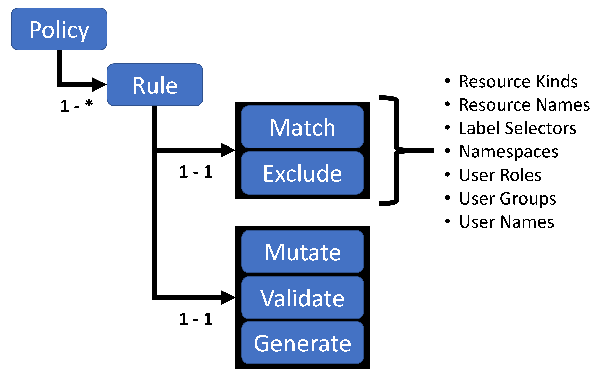

<small>*[documentation](/README.md#documentation) / Writing Policies*</small>

# Writing Policies

The following picture shows the structure of a Kyverno Policy:



Each Kyverno policy contains one or more rules. Each rule has a match clause, an optional excludes clause, and a mutate, validate, or generate clause.

When Kyverno receives an admission controller request, i.e. a validation or mutation webhook, it first checks to see if the resource and user information matches or should be excluded from processing. If both checks pass, then the rule logic to mutate, validate, or generate resources is applied.

The following YAML provides an example for the match and validate clauses.

````yaml
apiVersion : kyverno.io/v1
kind : ClusterPolicy
metadata :
  name : policy
spec :
  # 'enforce' to block resource request if any rules fail
  # 'audit' to allow resource request on failure of rules, but create policy violations to report them
  validationFailureAction: enforce
  # Each policy has a list of rules applied in declaration order
  rules:
    # Rules must have a unique name
    - name: "check-pod-controller-labels"      
      # Each rule matches specific resource described by "match" field.
      match:
        resources:
          kinds: # Required, list of kinds
          - Deployment
          - StatefulSet
          name: "mongo*" # Optional, a resource name is optional. Name supports wildcards * and ?
          namespaces: # Optional, list of namespaces. Supports wilcards * and ?
          - "dev*"
          - test
          selector: # Optional, a resource selector is optional. Selector values support wildcards * and ?
              matchLabels:
                  app: mongodb
              matchExpressions:
                  - {key: tier, operator: In, values: [database]}
        # Optional, subjects to be matched
        subjects:
        - kind: User
          name: mary@somecorp.com
        # Optional, roles to be matched
        roles:
        # Optional, clusterroles to be matched
        clusterroles:
      # Resources that need to be excluded
      exclude: # Optional, resources to be excluded from evaulation
        resources:
          kinds:
          - Daemonsets
          name: "*"
          namespaces:
          - prod
          - "kube*"
          selector:
              matchLabels:
                  app: mongodb
              matchExpressions:
                  - {key: tier, operator: In, values: [database]}
        # Optional, subjects to be excluded
        subjects:
        # Optional, roles to be excluded
        roles:
        # Optional, clusterroles to be excluded
        clusterroles:
          - cluster-admin
          - admin
    
     # Each rule can contain a single validate, mutate, or generate directive
     ...
````

Each rule can validate, mutate, or generate configurations of matching resources. A rule definition can contain only a single **mutate**, **validate**, or **generate** child node. These actions are applied to the resource in described order: mutation, validation and then generation.


---
<small>*Read Next >> [Validate](/documentation/writing-policies-validate.md)*</small>